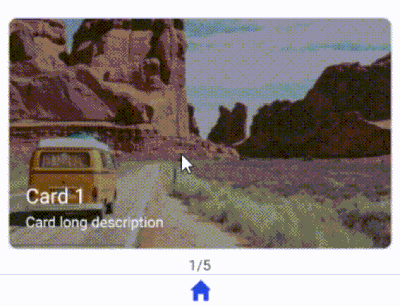
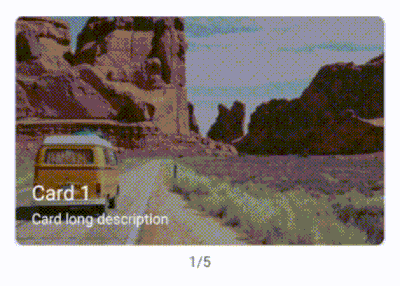
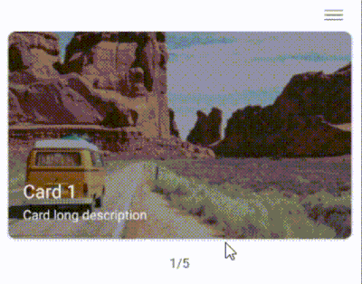

## React Native Snap Carousel & Card Stack

React Native Snap Carousel widget is a mobile widget for building ***static*** and ***dynamic*** content rotators and card stack.

## Features

* Static or dynamic content.
* Support adding action when item has been determined.
* Auto Play.
* Hide/Show Pagination.
* determined carousel and items Width.
* Enabled or disabled carousel.
* determined the first item to start with.
* Multi styling options.

## Usage

### 1. Default Carousel:


### 2. Card Stack:


### 3. Tinder:


## Issues, suggestions

1. **background**: For a 'Stack and Tinder' layout, make sure to apply a background color to your content to achieve the desired card stack view.
 
2. **Hight**: Ensure that all items have the same height to achieve the desired view.
 
3. **Layout grid**: Be careful when placing the carousel within a layout grid, as it might override the column size properties and determine its own width from the properties.

4. **Reversed view**: here's a tip if you want to achieve a reversed view when initializing the carousel in the 'stack and tinder' layout.

     * **Dynamic data types**, consider using a reversed list in the data source and modify the first item to represent the length of the list (or any fake large number greater the list length). Additionally, you may need to hide the pagination in this scenario.
  
     * **Static data types**: thw only thing you need is to change the first item to represent the number of all items (or any fake large number greater the number of the items), Additionally, you may need to hide the pagination in this scenario.

    


## Development and contribution

```
    $ cd [cloned widget folder]
    $ npm install
    $ npm run build
    <!-- will bundle the project in root level for this project, in a widget folder -->

    <!-- node version 16.17.1 -->
```

***************
 LinkedIn [Aseel Dweedar](https://www.linkedin.com/in/aseel-dweedar)